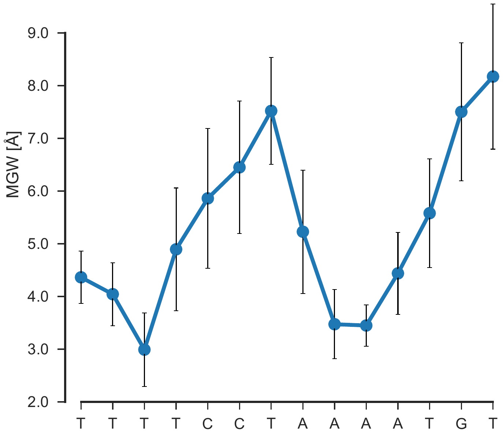

# Trj2Shape: DNA shape analyses of MD trajectories

Local deformations in DNA often play important roles in protein-DNA
recognition/interaction. To gain a better insight in the dynamics of
interaction, researchers use Molecular Dynamics (MD) simulations followed by
the trajectory analyses. `Trj2Shape` is designed to analyze the DNA shape
profiles that helps make better conclusions about the interaction mechanism.

`Trj2Shape` currently analyzes four DNA shape features— Minor Groove Width
(MGW), Propeller Twist (ProT), Helix Twist (HelT) and Roll angle (Roll). 

I've created three different READMEs serving different purposes:

- MD snapshots generation, see [here](./MD.trj.processing.md)
- High-throughput version of Trj2Shape, see [here](./README.cluster_version.md)
- Curves processing basics, see [here](./Curves.processing.md)

This documentation assumes **${Trj2Shape}** shell variable as github cloned path.
Its preferred to use `Trj2Shape` scripts in existing data directories. It saves
data I/O operations.

The goal for this work to come up with shape profiles like the following (shown
here for MGW).

  

