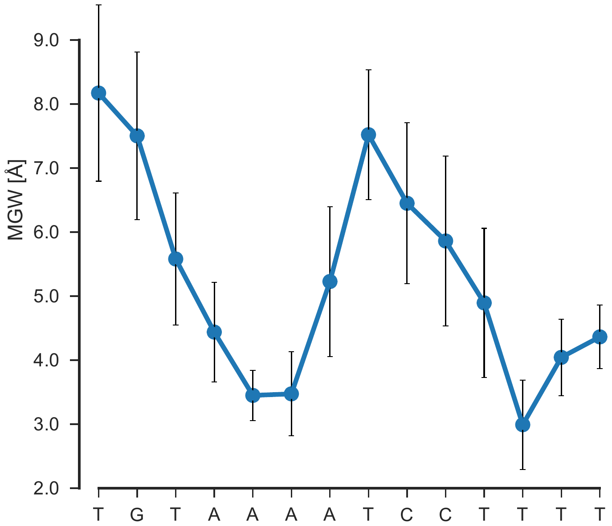

# Visualizing shape feature profiles

One of the core of this method is to visualize the shape feature profiles
(average and standard deviations) at bp resolution. I have wrote script to
serve this purpose; the nitty-gritty can be found in the
[jupyter-notebook](./Shape_plotter.ipynb). In addition, I have also written
script for generating publication level images that one can directly use,
however it requires latex installation on your system. Please feel free to make
changes as per your needs. 

```bash
$ python publication_type_plotter.py --config shape_plot.yaml --out avg_MGW_3n4m.png

```
The above command generates the MGW profile shown below

<p align="center">
    
</p>
